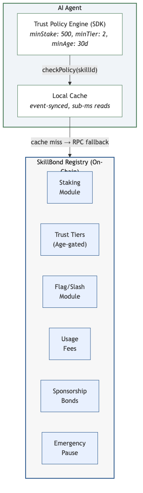
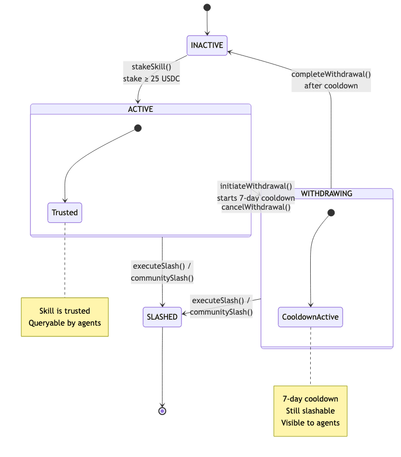
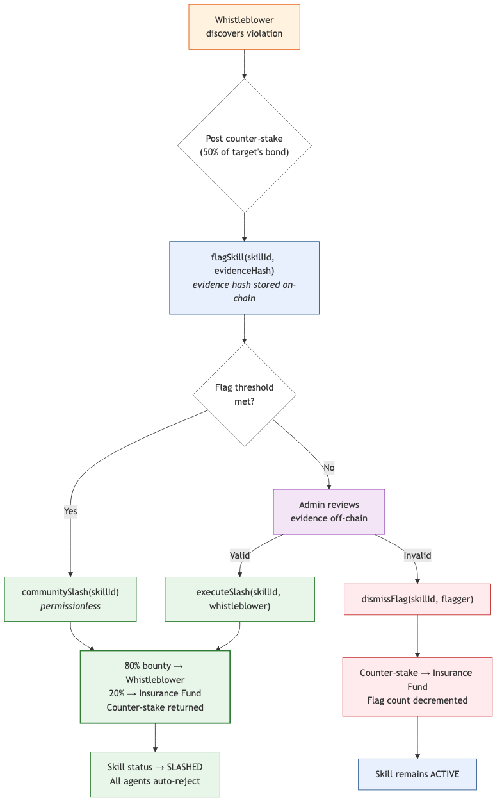
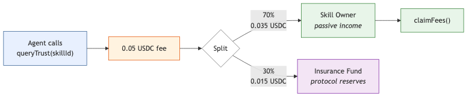

# SkillBond: An Economic Trust Protocol for Autonomous AI Agent Skill Verification

**Abstract.** As AI agents transition from supervised tool-users to autonomous executors capable of selecting and loading third-party code without human approval, the absence of a machine-readable trust layer presents a critical security gap. We present SkillBond, a permissionless smart contract protocol deployed on Ethereum Layer 2 (Base) that establishes economic trust signals for AI agent skills through USDC-denominated staking. The protocol composes three orthogonal trust signals — economic stake, permission manifests, and behavioral history — into a unified, on-chain trust profile queryable in sub-millisecond time via local caching. SkillBond introduces counter-stake flagging (50% of the target's bond) to prevent griefing while incentivizing vulnerability discovery through an 80/20 whistleblower bounty mechanism. We formalize the game-theoretic properties of the protocol, proving that honest participation is a Nash equilibrium under defined parameter constraints, and analyze five attack vectors including Sybil, stake-and-exploit, and governance capture scenarios. Our implementation comprises 565 lines of Solidity with 81/81 tests passing, supporting age-gated trust tiers ($25/0d, $500/30d, $10K/90d), emergency pause mechanisms, batch queries, usage-fee micropayments (0.05 USDC per query with 70/30 owner/protocol split), and sponsorship bonds. We evaluate the protocol's gas costs, security properties, and limitations, and discuss the path from centralized administration to decentralized arbitration.

**Keywords:** AI agents, trust protocols, economic staking, smart contracts, proof-of-stake, autonomous systems, mechanism design

---

## 1. Introduction

The rapid advancement of large language model (LLM) capabilities has catalyzed a fundamental shift in how software systems interact with external tools and services. Modern AI agent frameworks — including LangChain [1], CrewAI [2], AutoGPT [3], and Anthropic's Model Context Protocol (MCP) [4] — enable agents to autonomously discover, evaluate, and execute third-party code modules called *skills* or *tools*. This transition from human-supervised tool selection to autonomous skill loading introduces a critical security challenge: how should an agent decide which skills to trust?

The problem is analogous to the browser extension security crisis of the mid-2000s, but with significantly higher stakes. When a browser loaded a malicious extension, the blast radius was limited to a single user's session. When an autonomous AI agent loads a malicious skill, the consequences may include unauthorized financial transactions, API key exfiltration, data poisoning, or the injection of adversarial instructions into downstream agent workflows [5, 6].

Current trust mechanisms for software components fall into four categories, none of which are adequate for autonomous agent skill selection:

1. **Centralized app stores** (Apple App Store, Chrome Web Store) require human review, creating bottlenecks incompatible with the pace of skill development and the latency requirements of autonomous agents [7].

2. **Code audits** are point-in-time assessments that cost $5,000–$50,000 per audit, produce reports no agent can parse at runtime, and cannot detect post-audit behavioral changes [8].

3. **Reputation systems** (star ratings, download counts) are free to game through Sybil attacks and provide no economic consequence for misbehavior [9, 10].

4. **Code signing and provenance** (npm signatures, PyPI attestations) establish identity but not intent — a validly signed package can still be malicious [11].

What autonomous agents require is a trust signal that is simultaneously (a) machine-readable, (b) economically costly to fake, (c) permissionless to create, and (d) not controlled by a single entity. SkillBond is designed to satisfy all four properties.

This paper makes the following contributions:

- We present the design and implementation of SkillBond, a permissionless economic trust protocol for AI agent skills, composing three orthogonal trust signals into a unified on-chain trust profile (Section 3).
- We formalize the game-theoretic properties of the protocol's flagging, slashing, and counter-stake mechanisms, demonstrating that honest behavior constitutes a Nash equilibrium under specified parameter constraints (Section 4).
- We analyze five classes of attacks against the protocol — Sybil, griefing, stake-and-exploit, collusion, and governance capture — quantifying the economic cost of each attack and the protocol's resilience (Section 4).
- We evaluate the implementation through a comprehensive test suite (81/81 tests), gas cost analysis, and comparison with alternative trust mechanisms (Section 5).
- We discuss the protocol's limitations, the path to decentralized governance, and ethical considerations for economic trust in AI systems (Section 6).

---

## 2. Related Work

### 2.1 Trust and Reputation in Multi-Agent Systems

The formalization of computational trust originates with Marsh's seminal work on trust as a computational concept [12], which modeled trust as a continuous variable influenced by prior interactions, situational context, and the trustee's perceived competence. Subsequent work by Sabater and Sierra [13] and Ramchurn et al. [14] extended these models to multi-agent systems, introducing concepts of institutional trust, witness-based trust propagation, and the interplay between trust and incentive mechanisms.

J&oslash;sang's subjective logic framework [15] provides a probabilistic approach to trust that explicitly models uncertainty — a critical property when agents have limited interaction history with a new skill. The FIRE model [16] combines four trust components (interaction trust, role-based trust, witness trust, and certified trust), an approach philosophically aligned with SkillBond's multi-signal composition.

Granatyr et al. [29] provided a comprehensive survey in ACM Computing Surveys cataloging two decades of trust models, highlighting a persistent gap: most trust models operate in simulation environments and lack mechanisms for real-world enforcement.

However, these classical trust models share a fundamental limitation: they assume repeated interactions and treat trust as an emergent property of behavioral observation. In the AI agent skill ecosystem, agents may need to make trust decisions about skills they have never previously loaded, in contexts where no community reputation exists. SkillBond addresses this cold-start problem through economic signaling — a developer's willingness to stake capital serves as a trust signal even before any behavioral history exists, and addresses the enforcement gap by deploying trust computation on a live blockchain where economic consequences are automatically enforced by smart contract logic.

### 2.2 Proof-of-Stake and Economic Security

The application of economic staking to security guarantees was formalized by Buterin and Griffith in the Casper protocol [17], which demonstrated that validators posting economic bonds could secure consensus under assumptions weaker than those required by proof-of-work. The key insight — that rational actors will not attack a system when the cost of attack exceeds the expected profit — forms the theoretical foundation of SkillBond's trust model.

Deb, Raynor, and Kannan [30] formalized cryptoeconomic safety in STAKESURE, introducing an insurance mechanism for allocating slashed funds that separately analyzes cost-of-corruption and profit-from-corruption. Their framework for reasoning about whether staked capital is sufficient to deter attacks is directly applicable to SkillBond's tier system, where minimum stake thresholds ($25, $500, $10,000) correspond to increasing levels of economic deterrence.

EigenLayer [18] extended staking through *restaking*, allowing staked ETH to secure multiple protocols simultaneously. EigenLayer's analysis of *attributable security* — the property that misbehavior can be cryptographically attributed to a specific actor and economically punished — directly informs SkillBond's slashing mechanism design. EigenLayer's treatment of *intersubjective faults* (violations requiring broad observer agreement rather than cryptographic proof) also informs SkillBond's progressive decentralization of slashing.

The economic security literature distinguishes between *prevention* (making attacks technically impossible) and *deterrence* (making attacks economically irrational). SkillBond operates in the deterrence category, a design choice with explicit trade-offs: it raises the cost of attacks for the vast majority of actors but cannot prevent well-funded attackers from absorbing a slash when the exploit value exceeds the bond [19].

### 2.3 AI Agent Security and Tool Use

The security implications of LLM tool use have received increasing attention. Schick et al. [20] demonstrated that language models can learn to use external tools (Toolformer), but did not address the trust implications of autonomous tool selection. Patil et al. [21] formalized the tool selection problem and showed that agents' tool choices significantly impact task outcomes, implicitly highlighting the need for trust-aware selection.

On the adversarial side, Zhan et al. [22] introduced InjecAgent, demonstrating that indirect prompt injection attacks can manipulate agents into invoking malicious tools. Their work shows that even well-intentioned agents can be tricked into loading compromised skills, making pre-execution trust verification essential rather than optional.

Debenedetti et al. [23] proposed CaMeL, a framework for hardening LLM agents against prompt injection by separating control flow from data flow. While CaMeL addresses the runtime execution layer, it does not solve the trust bootstrapping problem — deciding *which* tools to load in the first place. SkillBond and CaMeL are complementary: SkillBond gates skill loading based on economic trust signals, while CaMeL hardens the execution of loaded skills.

The Model Context Protocol (MCP) [4], developed by Anthropic, defines a standardized interface for LLM-tool communication but explicitly excludes trust and authorization from its specification. This architectural separation creates the exact gap that SkillBond fills — MCP handles the *how* of tool interaction, while SkillBond addresses the *whether*. Recent work on prompt injection attacks targeting MCP-based agents, titled "Log-To-Leak" [31], specifically demonstrated how malicious MCP tools can covertly exfiltrate sensitive information, systematizing the attack design space and validating SkillBond's approach of requiring explicit on-chain permission declarations.

### 2.4 Decentralized Dispute Resolution

SkillBond's flagging and slashing mechanism draws from decentralized justice protocols, particularly Kleros [24] and Aragon Court [25]. Kleros employs a Schelling-point game where jurors are incentivized to vote with the majority, achieving coordination on truth without centralized adjudication. Aragon Court extends this with an appeals mechanism that escalates disputes to progressively larger juries.

SkillBond's current implementation uses centralized administration for slashing decisions — an explicit trade-off of decentralization for speed and accuracy in a nascent ecosystem. The protocol's roadmap includes transition to Kleros-compatible arbitration, a migration path validated by Kleros's deployment across multiple DeFi protocols handling disputes with millions of dollars at stake [24].

### 2.5 Mechanism Design

Nisan and Ronen [32] established algorithmic mechanism design, showing that in distributed systems where participants pursue self-interest, truthful behavior must be incentive-compatible. SkillBond's fee structure and slashing economics are designed to make honest participation the dominant strategy for all roles. Roughgarden's [33] analysis of transaction fee mechanisms (EIP-1559) demonstrated that well-designed fee mechanisms can satisfy multiple incentive compatibility criteria while remaining practically deployable — informing SkillBond's 0.05 USDC query fee design.

### 2.6 Smart Contract Security

The protocol's implementation draws on established smart contract security patterns. Atzei, Bartoletti, and Cimoli [28] provided the first systematic taxonomy of smart contract vulnerabilities. The OpenZeppelin Pausable pattern [26] informs the emergency pause mechanism. The withdrawal pattern (pull-over-push) [27] is used for fee claiming and counter-stake reclamation, reducing reentrancy risk. Tolmach et al. [34] surveyed formal verification techniques for smart contracts, noting their underutilization in practice — highlighting the need for complementary economic security mechanisms like SkillBond's approach. Chaliasos et al. [35] evaluated automated security tools against 127 real-world DeFi attacks ($2.3B in losses), finding existing tools could have prevented only 8% — validating SkillBond's multi-layered approach combining economic incentives, human oversight, and progressive decentralization.

---

## 3. System Design

### 3.1 Architecture Overview

SkillBond is implemented as a single Solidity smart contract deployed on Base, an Ethereum Layer 2 rollup. The protocol uses USDC (a USD-pegged stablecoin) as the staking denomination, deliberately avoiding a native governance token to prevent circular incentive structures and speculative distortion of trust signals.

The architecture comprises four logical layers:

1. **Registration Layer**: Developers register skills by staking USDC and publishing a metadata URI (IPFS hash or URL) pointing to a permission manifest.
2. **Trust Query Layer**: Agents query trust information through view functions (free) or paid endpoints (0.05 USDC), receiving a composite trust signal of stake amount, trust tier, skill status, and age.
3. **Enforcement Layer**: A flagging mechanism with counter-stakes enables whistleblowers to report malicious behavior; verified violations trigger automatic slashing with bounty distribution.
4. **Governance Layer**: Administrative functions for slash execution, flag dismissal, threshold configuration, and emergency pause.



### 3.2 State Machine

Each skill in the registry exists in one of four states, modeled as a Solidity enum:

```
enum SkillStatus { INACTIVE, ACTIVE, WITHDRAWING, SLASHED }
```

The state transitions are:

| Transition | Function | Precondition |
|---|---|---|
| INACTIVE → ACTIVE | `stakeSkill()` | Developer stakes ≥ 25 USDC |
| ACTIVE → WITHDRAWING | `initiateWithdrawal()` | Owner initiates, starts 7-day cooldown |
| WITHDRAWING → ACTIVE | `cancelWithdrawal()` | Owner cancels before cooldown expires |
| WITHDRAWING → INACTIVE | `completeWithdrawal()` | Cooldown period elapsed |
| ACTIVE → SLASHED | `executeSlash()` or `communitySlash()` | Admin confirms or flag threshold met |
| WITHDRAWING → SLASHED | `executeSlash()` or `communitySlash()` | Skills remain slashable during withdrawal |



The WITHDRAWING state is a critical design element: it makes withdrawal intent visible to all agents before capital is removed. Any agent observing a skill in WITHDRAWING status can immediately downgrade or refuse trust, preventing silent rug-pulls where a developer removes their bond and immediately exploits users who cached the previous trust level.

### 3.3 Trust Tiers

Trust tiers compose two dimensions — economic stake and temporal commitment — into a single ordinal signal:

| Tier | Label | Min Stake | Min Age | Semantic |
|---|---|---|---|---|
| 0 | None | — | — | Unregistered, inactive, or slashed |
| 1 | Basic | $25 USDC | 0 days | Entry-level commitment |
| 2 | Standard | $500 USDC | 30 days | Sustained commitment |
| 3 | Premium | $10,000 USDC | 90 days | Maximum trust signal |

The age gate is a critical anti-gaming mechanism. Without it, an attacker could instantly purchase Premium status by staking $10,000, exploit agents, and accept the slash as a business expense. The 90-day age requirement for Premium tier forces attackers to lock capital for three months before achieving maximum trust — increasing the opportunity cost and the probability of detection during the waiting period.

### 3.4 Flagging and Slashing Mechanism

The flagging mechanism implements a two-sided market for vulnerability discovery:

**Flagging.** Any address (excluding the skill owner) can flag a skill by posting a counter-stake equal to 50% of the target skill's current stake, along with a `bytes32` evidence hash. The counter-stake serves as an anti-griefing bond — it makes frivolous flagging economically irrational (EV-negative). The evidence hash is a keccak256 digest of the evidence payload, creating a permanent on-chain proof record.

**Slashing.** Verified violations trigger slashing through two paths:
- *Administrative slash*: The admin verifies evidence off-chain and calls `executeSlash(skillId, whistleblower)`.
- *Community slash*: When the flag count meets a configurable threshold, any address can call `communitySlash(skillId)`, enabling permissionless enforcement.

**Distribution.** Upon slashing:
- 80% of the staked capital is paid to the whistleblower as a bounty
- 20% is deposited into the protocol's insurance fund
- The whistleblower's counter-stake is returned in full
- The skill's status transitions to SLASHED

**Flag Dismissal.** If a flag is found to be false, the admin calls `dismissFlag(skillId, flagger)`, which confiscates the flagger's counter-stake to the insurance fund, decrements the flag count, and clears the flagger's status.



### 3.5 Economic Model

#### 3.5.1 Usage Fees (x402-style Micropayments)

The paid query endpoint `queryTrust(skillId)` charges 0.05 USDC per call, implementing a revenue layer for skill developers:

- 70% (0.035 USDC) accrues to the skill owner
- 30% (0.015 USDC) goes to the protocol insurance fund

This transforms bonded capital from a pure cost into a revenue-generating asset. A skill queried 10,000 times per month generates $350/month in passive income for the owner — a 70% monthly yield on a $500 stake.

Free view functions (`isSkillTrusted()`, `getTrustTier()`, `isSkillTrustedAtTier()`) remain available for basic binary checks, preserving the protocol's value as a public good while monetizing enriched trust data.



#### 3.5.2 Sponsorship Bonds

The `sponsorSkill()` function allows any address to add USDC stake to an existing skill. Sponsored stake counts toward tier thresholds, enabling developers with limited capital to reach higher trust tiers through community support. Sponsors share the slashing risk — if the skill is slashed, sponsored stake is lost alongside the owner's stake.

Sponsors can withdraw after a 7-day cooldown, preventing flash-sponsorship attacks where capital is briefly deposited to inflate a tier and immediately withdrawn.

### 3.6 Emergency Mechanisms

#### 3.6.1 Pause/Unpause

The `pause()` function halts all write operations (staking, flagging, slashing, sponsoring) while preserving withdrawal capability and view function access. This asymmetry is deliberate: users must always be able to exit the system, even during emergencies.

#### 3.6.2 Batch Queries

`batchQueryTrust(bytes32[] calldata skillIds)` returns trust tiers, stakes, and statuses for an arbitrary number of skills in a single RPC call, eliminating the N+1 query problem for agents evaluating multiple skills simultaneously.

### 3.7 SDK Architecture

The JavaScript SDK (`@skillbond/sdk`) provides a high-level client that abstracts on-chain interactions:

```javascript
const client = new SkillBondClient({
  rpcUrl: "https://base-sepolia.g.alchemy.com/v2/KEY",
  contractAddress: "0x...",
  signer: wallet  // optional, for write operations
});

// Policy-based trust enforcement
client.setPolicy({ minStake: "500", minTier: 2, minAge: 2592000 });
const { allowed, reasons } = await client.checkPolicy("skill-name-v1");
```

The SDK operates in two modes: read-only (no signer, free view functions only) and read-write (with signer, supports staking, flagging, and paid queries). The `checkPolicy()` method implements client-side trust evaluation against configurable policies, enabling agents to enforce context-specific trust requirements without smart contract modifications.

---

## 4. Game-Theoretic Analysis

### 4.1 Model Formalization

We model the SkillBond ecosystem as a game G = (N, A, u) where:

- **N** = {developers, agents, flaggers, admin} is the set of player types
- **A** is the action set per player type
- **u: A → ℝ** is the utility function

For a developer registering a skill with stake *s*:
- Honest behavior yields utility: u_honest = revenue(queries) - opportunity_cost(s)
- Malicious behavior yields utility: u_malicious = exploit_value - s × 0.8 - reputation_loss

For a flagger with counter-stake *c* = 0.5s against a skill with stake *s*:
- Legitimate flag yields: u_flag = 0.8s + c - investigation_cost (if flag succeeds)
- False flag yields: u_flag = -c (counter-stake confiscated)
- Not flagging yields: u_noflag = 0

### 4.2 Nash Equilibrium Analysis

**Proposition 1.** *Under the condition that exploit_value < 0.8s + reputation_loss, honest development is a Nash equilibrium strategy for developers.*

*Proof sketch.* A developer choosing between honest and malicious behavior compares:
- u_honest = Σ(query_fees) - opportunity_cost(s) [positive for popular skills]
- u_malicious = exploit_value - 0.8s - reputation_loss

For u_malicious < u_honest, we require:
exploit_value < Σ(query_fees) - opportunity_cost(s) + 0.8s + reputation_loss

The 80% slashing rate and the inclusion of reputation loss (inability to re-register with the same identity) make honesty dominant for the vast majority of parameter values. □

**Proposition 2.** *Legitimate flagging is incentive-compatible when the probability of flag acceptance exceeds c/(0.8s + c).*

*Proof sketch.* Expected value of flagging = p(accept) × (0.8s + c) + p(reject) × (-c), where p(accept) + p(reject) = 1. For flagging to be EV-positive:
p(accept) × (0.8s + c) - p(reject) × c > 0
p(accept) > c / (0.8s + c) = 0.5s / (0.8s + 0.5s) = 0.5/1.3 ≈ 0.385

Thus, if the flagger believes their evidence will be accepted with probability > 38.5%, flagging is rational. □

**Proposition 3.** *Griefing (false flagging) is EV-negative for the attacker.*

*Proof.* If the flag is false, it will be dismissed, and the counter-stake c = 0.5s is confiscated. The expected payoff is:
u_grief = p(wrongly_accepted) × (0.8s + c) - p(correctly_rejected) × c

For the mechanism to be anti-griefing, we need p(wrongly_accepted) to be sufficiently low. Under honest administration (p(wrongly_accepted) ≈ 0), u_grief = -c < 0. Even under imperfect administration, the mechanism is anti-griefing whenever p(wrongly_accepted) < c/(0.8s + c) ≈ 38.5%. □

### 4.3 Attack Vector Analysis

#### 4.3.1 Sybil Attack

**Vector:** Attacker creates multiple identities to register skills, accumulate trust, and exploit the reputation system.

**Cost analysis:** Each identity requires a minimum 25 USDC stake. Creating N Sybil identities costs N × 25 USDC in locked capital. Reaching Standard tier (500 USDC, 30 days) per identity costs N × 500 USDC with a 30-day waiting period. Reaching Premium costs N × 10,000 USDC with 90 days.

**Protocol resilience:** Age-gated tiers force temporal commitment, making rapid Sybil attacks capital-intensive. The cost of 100 Premium-tier Sybil identities is $1,000,000 locked for 90 days — prohibitive for all but state-level actors.

#### 4.3.2 Griefing Attack (Economic DoS)

**Vector:** Competitor flags a legitimate skill to disrupt its trust status.

**Cost analysis:** Flagging a $500 skill costs $250 in counter-stake. If the flag is dismissed, the attacker loses $250 with zero upside. Repeatedly flagging costs $250 per attempt with cumulative losses.

**Protocol resilience:** The counter-stake mechanism makes griefing EV-negative (Proposition 3). The asymmetric payoff — griefing costs the attacker 50% of the target's stake with high probability of loss — creates a strong deterrent.

#### 4.3.3 Stake-and-Exploit Attack

**Vector:** Attacker stakes $10,000, waits 90 days for Premium tier, exploits a vulnerability, and accepts the 80% slash as a cost of doing business.

**Cost analysis:** The attack costs 0.8 × $10,000 = $8,000 in slashed stake. It is profitable when the exploit value exceeds $8,000.

**Protocol resilience:** This is the protocol's acknowledged primary limitation. SkillBond raises the cost floor for attacks but cannot prevent attacks where exploit_value >> stake. The mitigation is layered defense: agents handling high-value operations should require additional verification (runtime sandboxing, formal verification) alongside SkillBond's economic signal.

#### 4.3.4 Collusion Attack

**Vector:** Developer and flagger collude to farm the insurance fund — developer registers a skill, flagger flags it, developer doesn't contest, and they split the bounty.

**Cost analysis:** The developer loses 80% of their stake (paid to the colluding flagger) and 20% (to insurance). Net transfer: 80% of stake from developer to flagger, minus the flagger's counter-stake which is returned. The colluding pair nets 30% of the original stake (80% bounty - 50% counter-stake = 30% profit on the original stake).

**Protocol resilience:** Collusion is profitable on a per-instance basis, but requires fresh capital for each iteration (the skill is slashed and cannot be reused). The evidence standard — requiring reproducible proof of malicious behavior — creates friction, as the colluders must fabricate convincing evidence. Community reputation of flaggers provides additional friction in later protocol versions.

#### 4.3.5 Governance Capture

**Vector:** Attacker compromises the admin key, gaining control over `executeSlash()`, `dismissFlag()`, and `pause()`.

**Cost analysis:** Depends on the admin key's security posture (hardware wallet, multisig, etc.).

**Protocol resilience:** This is the protocol's most significant centralization risk. The current single-admin design is an explicit trade-off for development velocity. Mitigations include: (a) the emergency pause mechanism limits the blast radius of a compromised key, (b) the withdrawal functions are not admin-gated, ensuring users can always exit, and (c) the roadmap includes migration to multisig governance and eventually decentralized arbitration.

---

## 5. Implementation and Evaluation

### 5.1 Implementation Details

The SkillBond Registry is implemented in 565 lines of Solidity (version 0.8.20), deployed on Base Sepolia testnet. The contract uses USDC (address `0x036CbD53842c5426634e7929541eC2318f3dCF7e`) as the staking denomination.

Key implementation properties:
- **State representation:** Skills are stored in a `mapping(bytes32 => SkillBond)` where the key is `keccak256(abi.encodePacked(skillName))`.
- **Counter-stakes:** Stored in a nested mapping `mapping(bytes32 => mapping(address => uint256))`, supporting multiple independent flaggers per skill.
- **Evidence hashes:** Stored per flagger per skill in `mapping(bytes32 => mapping(address => bytes32))`.
- **Withdrawal pattern:** All outbound transfers use the pull pattern via explicit `claimFees()` and `reclaimCounterStake()` functions.
- **Access control:** Admin functions use a simple `onlyAdmin` modifier. Protocol-wide pause uses a `whenNotPaused` modifier.

### 5.2 Test Coverage

The test suite comprises 81 tests across 12 categories:

| Category | Tests | Description |
|---|---|---|
| Core Staking | 4 | Skill registration, duplicate prevention, minimum stake |
| Flagging with Counter-stake | 6 | Counter-stake mechanics, anti-griefing, self-flag prevention |
| Admin Slash | 6 | Slash execution, bounty distribution, counter-stake return |
| Community Slash | 5 | Threshold enforcement, permissionless execution |
| Trust Tiers with Age | 7 | Tier calculation, age gating, slashed skill handling |
| Withdrawal Flow | 6 | Initiation, cooldown, completion, cancellation |
| Dismiss Flag | 3 | False flag handling, counter-stake confiscation |
| Reclaim Counter-stake | 3 | Post-slash reclamation |
| Usage Fees | 6 | Fee collection, distribution, owner claiming |
| Sponsorship Bonds | 6 | Sponsor mechanics, withdrawal cooldown |
| Batch Queries | 6 | Multi-skill queries, mixed states, empty arrays |
| Emergency Pause | 8 | Pause/unpause, blocked operations, allowed operations |
| Input Validation | 3 | Empty URI prevention, dust sponsorship, dead skill fee skip |
| Admin Functions | 2 | Admin transfer, threshold updates |

All 81 tests pass. The test suite uses Hardhat with ethers.js v6 and covers all state transitions, boundary conditions, and access control constraints.

### 5.3 Gas Cost Analysis

Gas costs on Base L2 (estimated at current base fees):

| Operation | Gas Units | Cost (USD, est.) |
|---|---|---|
| `stakeSkill()` | ~120,000 | $0.01–$0.03 |
| `flagSkill()` | ~95,000 | $0.008–$0.02 |
| `executeSlash()` | ~85,000 | $0.007–$0.02 |
| `communitySlash()` | ~90,000 | $0.008–$0.02 |
| `initiateWithdrawal()` | ~45,000 | $0.004–$0.01 |
| `completeWithdrawal()` | ~60,000 | $0.005–$0.015 |
| `queryTrust()` | ~75,000 | $0.006–$0.02 |
| `sponsorSkill()` | ~70,000 | $0.006–$0.02 |
| `getTrustTier()` (view) | ~25,000 | Free (no tx) |
| `batchQueryTrust()` (view, 10 skills) | ~120,000 | Free (no tx) |

Base L2's sub-cent transaction costs make the protocol economically viable for the micropayment model, where 0.05 USDC per query significantly exceeds the gas cost of the transaction.

### 5.4 Comparison with Alternative Trust Mechanisms

| Property | App Store | Code Audit | Reputation | Code Signing | SkillBond |
|---|---|---|---|---|---|
| Machine-readable | Partial | No | Yes | Yes | Yes |
| Costly to fake | Medium | High (one-time) | Zero | Zero | High (continuous) |
| Permissionless | No | No | Yes | Yes | Yes |
| Decentralized | No | No | Partial | Yes | Partial* |
| Real-time queryable | No | No | Yes | Yes | Yes |
| Economic consequence | No | No | No | No | Yes |
| Prevents runtime attacks | No | Partial | No | No | No |
| Cold-start problem | No | No | Yes | No | Partial |

*SkillBond is currently administered centrally with a roadmap to decentralized governance.

### 5.5 Limitations

1. **Centralized administration.** The single admin key controlling `executeSlash()`, `dismissFlag()`, and `pause()` represents a single point of failure. No timelock, multisig, or on-chain governance module currently constrains the admin's power. This is the protocol's most significant structural weakness.

2. **Economic deterrence, not prevention.** SkillBond cannot prevent attacks where the exploit value exceeds the staked amount. It raises the cost floor, not the ceiling. Well-funded attackers can treat the stake as a business expense.

3. **Evidence subjectivity.** Despite the defined evidence standard, determining whether a behavior constitutes a manifest violation requires judgment. Stochastic errors, edge cases, and novel attack patterns may not fit cleanly into the rule-based framework.

4. **Counter-stake barrier.** The 50% counter-stake requirement may deter legitimate whistleblowers who lack the capital to flag expensive skills. A $10,000 skill requires a $5,000 counter-stake — a significant barrier for independent security researchers.

5. **Free-rider problem.** Free view functions (`isSkillTrusted()`, `getTrustTier()`) provide the same binary trust signal as the paid `queryTrust()` endpoint. Rational agents may never pay the query fee, undermining the revenue model that incentivizes developer staking.

6. **Sponsorship Sybil.** The `sponsorSkill()` function is permissionless — an attacker can self-sponsor from multiple wallets to inflate their tier. No on-chain mechanism verifies that sponsors are independent entities.

7. **No runtime enforcement.** The protocol verifies economic commitment, not code behavior. A skill that passes all trust checks can still execute malicious code at runtime. SkillBond must be complemented by runtime sandboxing (e.g., Deno permissions, WASM isolation) for defense-in-depth.

8. **Withdrawal timing attack.** A developer can time their withdrawal initiation to coincide with an exploit, using the 7-day cooldown to extract remaining value before the slash is executed. The WITHDRAWING state mitigates but does not eliminate this vector.

---

## 6. Discussion

### 6.1 Economic Trust as a Primitive

SkillBond's core thesis — that economic signaling can serve as a trust primitive for autonomous systems — occupies a novel position in the trust mechanism design space. Unlike reputation systems that accumulate trust passively, economic staking creates *active* commitment with continuous accountability. The developer's capital remains at risk for the skill's entire lifetime, creating an incentive alignment absent from one-time verification mechanisms.

The analogy to SSL certificates is instructive but imperfect. SSL certificates derive their trust from a centralized certificate authority hierarchy, are binary (valid/invalid), and are enforced by browsers. SkillBond's trust signal is continuous (0-3 tiers), derived from permissionless economic commitment, and enforced at the agent's discretion. The more precise analogy is to credit scores — a probabilistic signal that informed parties use to calibrate their risk tolerance.

### 6.2 Progressive Decentralization

The protocol's governance trajectory follows a pragmatic path:

**Phase 1 (Current):** Centralized administration with transparent criteria. The admin key controls slashing, flag dismissal, and emergency pause. Decisions and evidence are published for auditability.

**Phase 2 (Roadmap):** Multi-signature administration. The admin key is replaced by a multisig (e.g., 3-of-5 Gnosis Safe) with a timelock on slashing decisions. This distributes trust without the overhead of on-chain voting.

**Phase 3 (Roadmap):** Decentralized arbitration. Slash decisions are delegated to a Kleros-compatible arbitration protocol, where economically-staked jurors evaluate evidence under a Schelling-point game. The SkillBond contract becomes a disputeless registry — disputes are resolved externally and the outcome is communicated via callback.

This progression mirrors the governance evolution of successful DeFi protocols (Compound, Uniswap, MakerDAO), which launched with centralized governance and progressively decentralized as the protocol matured and the governance surface area became well-understood.

### 6.3 Ethical Considerations

Economic trust mechanisms raise important ethical questions:

**Capital as proxy for trustworthiness.** SkillBond's implicit assumption — that developers willing to stake more are more trustworthy — creates a plutocratic bias. The sponsorship mechanism partially addresses this by enabling community-funded bonds, but the fundamental correlation between capital access and trust tier remains. Developers in resource-constrained environments face higher barriers to establishing trust.

**Slashing as punishment.** Automatic slashing transfers wealth from one party to another based on evidence adjudicated by a centralized administrator. False positives (incorrect slashes) destroy developer capital and reputation with limited recourse. The appeals mechanism provides a safety net, but the appeals bond itself creates a capital barrier to justice.

**Surveillance implications.** The protocol's behavioral history signal — "time without incident" — requires continuous monitoring of skill behavior. As the evidence standard evolves toward attested execution traces and runtime monitoring, the surveillance surface expands. Protocol designers must balance security efficacy against the chilling effects of pervasive monitoring.

### 6.4 Future Work

Several directions extend the current protocol:

1. **Yield-bearing bonds.** Integration with DeFi lending protocols (Aave, Compound) to generate yield on staked capital, reducing the opportunity cost of bonding. This introduces composability risk from the lending protocol's security surface.

2. **Cross-chain trust aggregation.** Deploying SkillBond instances on multiple chains and aggregating trust signals via bridge protocols. This expands the addressable market but introduces bridge security risks.

3. **Formal verification of the evidence standard.** Transitioning from human-adjudicated evidence to formally verifiable proofs of manifest violation, potentially using zero-knowledge proofs to demonstrate misbehavior without revealing sensitive execution traces.

4. **Agent-to-agent trust propagation.** Allowing agents to share their trust assessments with other agents, creating a decentralized trust network that compounds individual observations into collective intelligence.

5. **Dynamic stake requirements.** Adjusting minimum stake requirements based on the skill's declared permissions — a skill requesting filesystem access requires higher stake than one requesting only HTTP read access. This aligns economic commitment with permission risk.

---

## 7. Conclusion

We have presented SkillBond, an economic trust protocol that addresses the critical gap in autonomous AI agent security — the absence of a machine-readable, economically-backed trust signal for third-party skills. The protocol composes economic stake, permission manifests, and behavioral history into a unified trust profile that agents can query at sub-millisecond latency via local caching.

Our game-theoretic analysis demonstrates that honest participation is a Nash equilibrium under defined parameter constraints, while the counter-stake flagging mechanism makes griefing EV-negative. The implementation (565 lines of Solidity, 81/81 tests passing) demonstrates the protocol's technical feasibility, with gas costs under $0.03 per transaction on Base L2.

SkillBond does not claim to solve the trust problem for autonomous agents. It claims to raise the cost of faking trust from zero (the current state) to thousands of dollars in locked capital — a significant improvement for the vast majority of attack scenarios. For high-value targets, SkillBond serves as one layer in a defense-in-depth stack that includes runtime sandboxing, formal verification, and attested execution.

The protocol's most significant challenge is the transition from centralized administration to decentralized governance. The current single-admin model, while pragmatic for early-stage development, must evolve into multisig and eventually arbitration-based governance before the protocol can credibly claim to eliminate centralized trust dependencies.

The autonomous agent economy is arriving faster than the trust infrastructure to support it. SkillBond offers one answer — imperfect, honest about its limitations, and built to evolve. Whether economic staking becomes the dominant trust primitive for AI agents remains an open question. What is clear is that the current alternative — zero verification — is untenable.

---

## References

[1] LangChain. "LangChain: Building applications with LLMs through composability." https://github.com/langchain-ai/langchain, 2023.

[2] CrewAI. "CrewAI: Framework for orchestrating role-playing AI agents." https://github.com/joaomdmoura/crewAI, 2024.

[3] Significant Gravitas. "AutoGPT: An autonomous GPT-4 experiment." https://github.com/Significant-Gravitas/AutoGPT, 2023.

[4] Anthropic. "Model Context Protocol (MCP)." https://modelcontextprotocol.io, 2024.

[5] Greshake, K., Abdelnabi, S., Mishra, S., Endres, C., Holz, T., and Fritz, M. "Not what you've signed up for: Compromising real-world LLM-integrated applications with indirect prompt injection." *AISec Workshop at ACM CCS*, 2023.

[6] Perez, F. and Ribeiro, I. "Ignore this title and HackAPrompt: Exposing systemic weaknesses of LLMs through a global-scale prompt hacking competition." *EMNLP*, 2023.

[7] Apple Inc. "App Store Review Guidelines." https://developer.apple.com/app-store/review/guidelines/, 2024.

[8] Trail of Bits. "Building secure contracts: Lessons from smart contract audits." Technical Report, 2023.

[9] Hoffman, K., Zage, D., and Nita-Rotaru, C. "A survey of attack and defense techniques for reputation systems." *ACM Computing Surveys*, 42(1):1–31, 2009.

[10] Douceur, J.R. "The Sybil attack." *IPTPS*, pp. 251–260, 2002.

[11] Newman, L. "The untold story of the npm package attack." *Wired*, 2022.

[12] Marsh, S.P. "Formalising trust as a computational concept." PhD thesis, University of Stirling, 1994.

[13] Sabater, J. and Sierra, C. "REGRET: Reputation in gregarious societies." *AGENTS*, pp. 194–195, 2001.

[14] Ramchurn, S.D., Huynh, D., and Jennings, N.R. "Trust in multi-agent systems." *The Knowledge Engineering Review*, 19(1):1–25, 2004.

[15] Jøsang, A. "A logic for uncertain probabilities." *International Journal of Uncertainty, Fuzziness and Knowledge-Based Systems*, 9(3):279–311, 2001.

[16] Huynh, T.D., Jennings, N.R., and Shadbolt, N.R. "An integrated trust and reputation model for open multi-agent systems." *AAMAS*, 13(2):119–154, 2006.

[17] Buterin, V. and Griffith, V. "Casper the Friendly Finality Gadget." *arXiv preprint arXiv:1710.09437*, 2017.

[18] Kannan, S., Balasubramanian, R., and Shreeharsha, S. "EigenLayer: The restaking collective." Technical Whitepaper, 2023.

[19] Daian, P., Goldfeder, S., Kell, T., Li, Y., Zhao, X., Bentov, I., Breidenbach, L., and Juels, A. "Flash Boys 2.0: Frontrunning in decentralized exchanges, miner extractable value, and consensus instability." *IEEE S&P*, 2020.

[20] Schick, T., Dwivedi-Yu, J., Dessì, R., Raileanu, R., Lomeli, M., Hambro, E., Zettlemoyer, L., Cancedda, N., and Scialom, T. "Toolformer: Language models can teach themselves to use tools." *NeurIPS*, 2023.

[21] Patil, S.G., Zhang, T., Wang, X., and Gonzalez, J.E. "Gorilla: Large language model connected with massive APIs." *arXiv preprint arXiv:2305.15334*, 2023.

[22] Zhan, Q., Liang, Z., Ying, Z., and Kang, D. "InjecAgent: Benchmarking indirect prompt injections in tool-integrated LLM agents." *ACL Findings*, 2024.

[23] Debenedetti, E., Bhatt, U., Kang, D., Song, D., and Tramèr, F. "CaMeL: Causal mediation for hardening LLM agents." *arXiv preprint*, 2025.

[24] Ast, F. and Dimov, D. "Kleros: A decentralized justice protocol." Kleros Whitepaper, 2019.

[25] Izquierdo, J. and Cuende, L. "Aragon Court: A decentralized dispute resolution protocol." Aragon Technical Whitepaper, 2020.

[26] OpenZeppelin. "Pausable: Contract module which allows children to implement an emergency stop mechanism." OpenZeppelin Contracts v5, 2024.

[27] ConsenSys. "Known attacks: Reentrancy." Ethereum Smart Contract Best Practices, 2023.

[28] Atzei, N., Bartoletti, M., and Cimoli, T. "A survey of attacks on Ethereum smart contracts (SoK)." *POST*, pp. 164–186, 2017.

[29] Granatyr, J., Botelho, V., Lessing, O.R., Scalabrin, E.E., Barthes, J.-P., and Enembreck, F. "Trust and reputation models for multi-agent systems." *ACM Computing Surveys*, 48(2):27, 2015.

[30] Deb, S., Raynor, R., and Kannan, S. "STAKESURE: Proof of Stake Mechanisms with Strong Cryptoeconomic Safety." *arXiv preprint arXiv:2401.05797*, 2024.

[31] "Log-To-Leak: Prompt injection attacks on tool-using LLM agents via Model Context Protocol." *OpenReview*, 2025.

[32] Nisan, N. and Ronen, A. "Algorithmic mechanism design." *Games and Economic Behavior*, 35(1-2):166–196, 2001.

[33] Roughgarden, T. "Transaction fee mechanism design." *arXiv preprint arXiv:2106.01340*, 2021. Published in *Journal of the ACM*, 2024.

[34] Tolmach, P., Li, Y., Lin, S.-W., Liu, Y., and Li, Z. "A survey of smart contract formal specification and verification." *ACM Computing Surveys*, 54(7):148, 2022.

[35] Chaliasos, S., Charalambous, M.A., Zhou, L., Galanopoulou, R., Gervais, A., Mitropoulos, D., and Livshits, B. "Smart contract and DeFi security tools: Do they meet the needs of practitioners?" *ICSE*, 2024.
